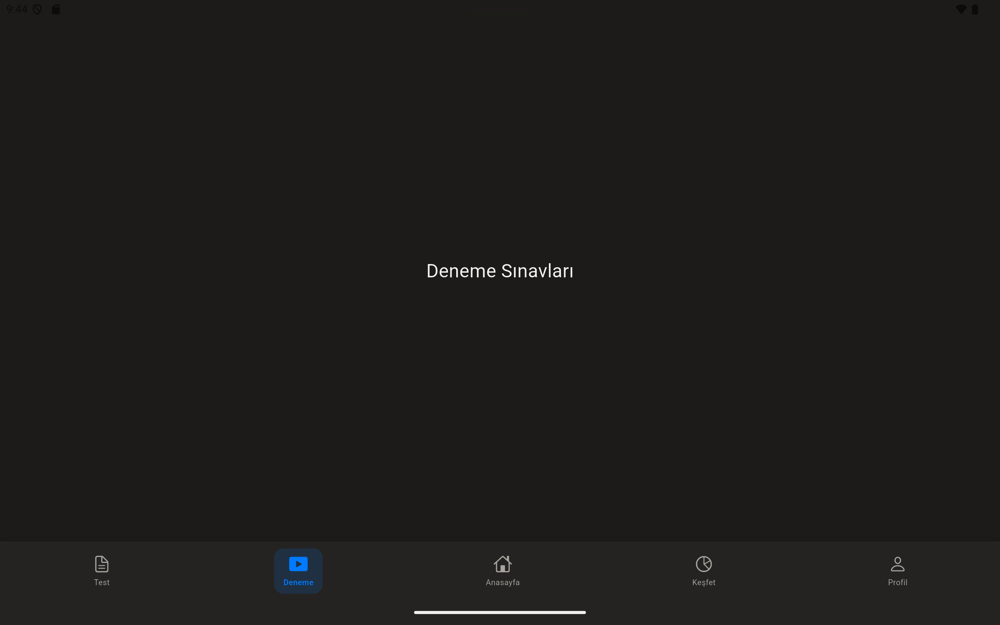

# YKS Master Tablet

> [!IMPORTANT]
> **LEGAL NOTICE & PRIVACY**
> This repository is publicly available for **portfolio demonstration and interview review purposes only**.
> All rights reserved. Reproduction, distribution, modification, or usage of this source code for commercial or non-commercial purposes without explicit written permission from the author is **strictly prohibited**.
> Certain sensitive configuration files (Firebase, API Keys) have been excluded for security reasons.

A tablet-first YKS (Higher Education Institutions Exam) preparation app for
iPad and Android tablets in landscape mode.

## Overview

YKS Master combines exam solving, a persistent scratchpad and mistake review
workflows. The main technical focus is the custom drawing layer: students can
write over questions, keep scratch work between sessions, and use shape
recognition for cleaner geometry diagrams.

## Key Features

- **Smart Exam Engine**: Full-screen exam solving with integrated persistent scratchpad.
- **Draw & Hold (Shape Snapping)**: Intelligent algorithm (Douglas-Peucker) that converts hand-drawn rough sketches into perfect geometric shapes.
- **Mistake Notebook (Yanlış Defteri)**: Automatically tracks incorrect answers and provides a focused interface for re-attempting failed questions.
- **Daily Analysis**: Intelligent notification system that reminds users of pending reviews.
- **Landscape Optimization**: Custom UI layout designed strictly for tablet experiences.

## Technical Stack

- **Framework**: Flutter
- **Architecture**: Clean Architecture (Data, Domain, Presentation layers)
- **State Management**: Flutter Riverpod
- **Dependency Injection**: get_it
- **Persistence**: SharedPreferences & Disk IO for stroke data
- **Backend**: Firebase (Auth & Firestore) - *Disconnected in this demo version*

## Repository Structure

- `lib/core`: Foundation, constants, and global utilities (including the Shape Recognizer).
- `lib/data`: Repository implementations and data sources.
- `lib/domain`: Business logic, entities, and repository interfaces.
- `lib/presentation`: Custom widgets, Riverpod providers, and Tablet-optimized UI pages.

---

Developed by **Göktürk Göçen** — [github.com/gokturkgocen](https://github.com/gokturkgocen).
